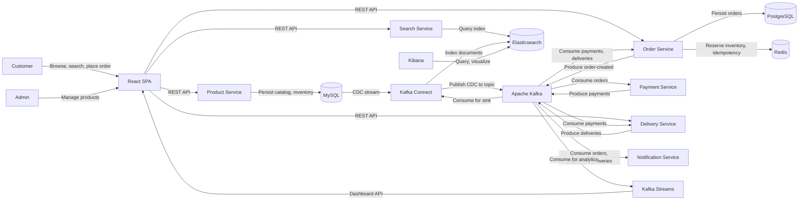
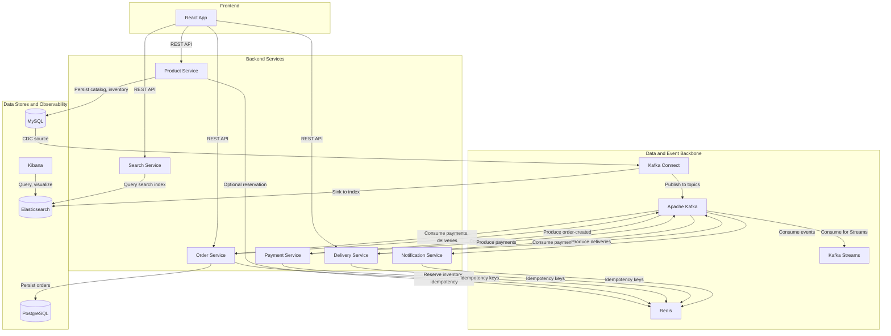
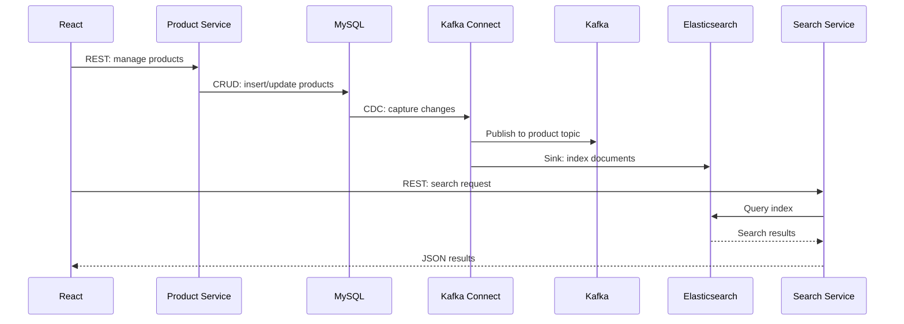
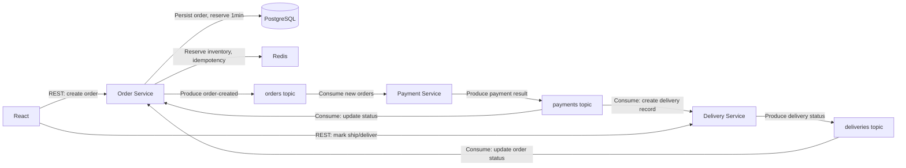
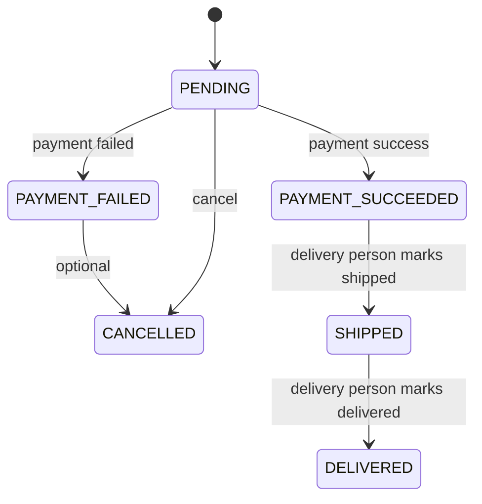

# E-commerce Final Project — High-Level and Low-Level Design

## 1. Introduction and Scope

### Purpose

This document describes the **High-Level Design (HLD)** and **Low-Level Design (LLD)** for the final integrated e-commerce project. The system applies learnings from the Kafka ecosystem course: Kafka producers/consumers, **Kafka Connect** (CDC with Debezium), **Kafka Streams** (analytics, alerts, dashboards), **saga pattern** (event choreography), and a **React** frontend.

### Scope

- **In scope:** Product catalog with search (Elasticsearch, Kibana), order placement, payment processing, delivery with UI-driven status updates, order status updates from events, notifications, inventory reservation (Redis, 1-minute TTL), and operational dashboards/alerts.
- **Out of scope for this document:** Step-by-step implementation, deployment runbooks, and detailed security design (only high-level mention).

---

## 2. High-Level Design (HLD)

### 2.1 System Context

#### Actors

- **Customer:** Browses and searches products, adds to cart, places orders, views order status.
- **Admin:** Manages products and inventory.

#### Systems

- **React SPA:** Customer and admin UI; optionally a delivery-person view for marking shipment/delivery.
- **Product Service:** Catalog and inventory (MySQL).
- **Search Service:** Product search (Elasticsearch).
- **Order Service:** Order creation and status (PostgreSQL); consumes payment and delivery events.
- **Payment Service:** Consumes order-created events from `orders` topic, processes payment, produces payment events.
- **Delivery Service:** Consumes successful payments, holds delivery state; REST for delivery person to mark SHIPPED/DELIVERED; produces delivery events.
- **Notification Service:** Consumes orders/payments/deliveries, sends email/push.
- **Apache Kafka:** Event backbone.
- **Kafka Connect:** Debezium MySQL (products), Elasticsearch Sink. Orders: Order Service produces to `orders` topic.
- **Kafka Streams:** Analytics, aggregations, alerts, dashboards.
- **Redis:** Inventory reservation (1 min TTL), idempotency keys.
- **MySQL:** Catalog and inventory. **PostgreSQL:** Orders. **Elasticsearch:** Search index. **Kibana:** Search/catalog visualization.

---

### 2.2 Container Diagram

---

### 2.3 Main Data Flows

#### Flow A – Product and Search

- Product Service (CRUD + inventory) writes to MySQL.
- Debezium MySQL CDC streams changes to Kafka topic (e.g. `mysql-product-products`).
- Kafka Connect Elasticsearch Sink (or equivalent) indexes product data into Elasticsearch.
- Kibana is used for index management and optional product dashboards.
- Search Service exposes REST API that queries Elasticsearch; React calls Search Service (and Product Service for by-ID when needed).

#### Flow B – Order Saga (End-to-End)

1. React calls Order Service to create order (items, customer). Products on UI come from catalogue/search; order creation implies items are in inventory. On create, **reserve inventory in Redis for 1 minute** (lock per order/items, TTL 60s). Order Service persists in PostgreSQL (e.g. status `PENDING`) and **produces an order-created event** directly to the `orders` topic.
2. **Payment Service** consumes `orders` (domain events from Order Service). It processes payment and produces to `payments` (SUCCESS/FAILED). Idempotency via Redis.
3. If payment succeeds within 1 min: confirm reservation (release Redis lock, deduct in MySQL). If payment fails or 1 min elapses: release reservation (TTL expiry or explicit delete).
4. Order Service (consumer) consumes `payments` and updates order status. Idempotency via Redis.
5. Delivery Service consumes `payments` (success only), creates internal delivery record (e.g. AWAITING_SHIPMENT). **Delivery progress is UI-driven:** a simulated delivery person on the React UI calls Delivery Service REST to mark SHIPPED or DELIVERED; Delivery Service then produces to `deliveries` topic. Idempotency via Redis.
6. Order Service (consumer) consumes `deliveries` and updates order status (SHIPPED, DELIVERED). Idempotency via Redis.

#### Flow C – Notifications

- Notification Service consumes `orders` (order-created events), `payments` (result), and `deliveries` (status).
- It sends email/push based on event type. Idempotency via Redis (e.g. `orderId:eventType`).

---

### 2.4 Technology Stack

<!-- markdownlint-disable MD060 -->
| Layer                | Technology                                                       |
| -------------------- | ---------------------------------------------------------------- |
| Frontend             | React (SPA)                                                      |
| Services             | Spring Boot 4.x, Java 25                                        |
| Message broker       | Apache Kafka 4.x                                                 |
| Connect              | Kafka Connect, Debezium (MySQL, Postgres), Elasticsearch Sink   |
| Streams              | Kafka Streams (analytics, alerts, dashboards)                   |
| Catalog DB            | MySQL (products, inventory)                                      |
| Order DB              | PostgreSQL (orders, order_items)                                 |
| Search                | Elasticsearch, Kibana                                            |
| Cache / reservation   | Redis (inventory lock TTL 1 min, idempotency keys)              |
| Observability         | Dashboards from Streams + Kibana (and optional Grafana)         |
<!-- markdownlint-enable MD060 -->

---

### 2.5 Integration Summary

- **Kafka Connect:** Debezium MySQL source (products/inventory) → Kafka topic; Elasticsearch Sink from product topic → ES index. **Orders:** Order Service produces order-created events directly to `orders` topic (no Postgres CDC for orders).
- **Kafka:** Event backbone for orders, payments, deliveries; consumers use Redis for idempotency.
- **Kafka Streams:** Consumes orders, payments, deliveries (and optionally product topic); builds aggregations (e.g. orders per hour, revenue, success/failure rates); state stores for real-time metrics; REST or UI for dashboards and alerts (e.g. failure rate threshold, lag).

---

## 3. Low-Level Design (LLD)

### 3.1 Product Service

**Responsibility:** CRUD for products, manage inventory (quantity); expose REST API for admin and (if needed) by-ID for frontend. Availability/reservation is coordinated with Redis (see 3.12).

**MySQL schema (conceptual):**

- `products`: id, name, description, sku, price, category_id, created_at, updated_at.
- `inventory`: product_id (FK), quantity, reserved_quantity, updated_at.

**API (key endpoints):**

- `POST /api/products`, `GET /api/products`, `GET /api/products/:id`, `PUT /api/products/:id`, `DELETE /api/products/:id`
- `PATCH /api/inventory/:productId` (optional for reserve/release or deduct after payment)

**CDC:** Debezium MySQL connector streams `products` (and optionally `inventory`) to Kafka (e.g. `mysql-product-products`). Connector config: logical name, table include list, key format.

---

### 3.2 Kafka Connect – CDC and Elasticsearch

**Debezium MySQL Source:** Database host, port, user; `database.include.list`, `table.include.list` (e.g. `product.products`, `product.inventory`); topic naming (e.g. `mysql-product-products`). Snapshot mode (initial), binlog position.

**Orders topic:** Populated by **Order Service** (application producer) after persisting the order — not by Debezium. Topic name e.g. `orders`. Key = order id; value = order-created event (order_id, customer_id, amount, items, etc.).

**Elasticsearch Sink:** Consumes from product CDC topic (or a dedicated normalized topic); maps to index `products`; document id = product id; connection URL; transforms if needed (e.g. extract envelope payload).

---

### 3.3 Search Service

**Responsibility:** Search and browse products; read from Elasticsearch (and optionally fallback/cache).

**API:** `GET /api/search?q=...&category=...&from=...&size=...` → query ES product index, return list (id, name, price, snippet, etc.).

**Data source:** Elasticsearch index populated by Connect (product CDC → ES sink). No direct MySQL; Search Service is read-only on ES. Availability shown on UI should consider Redis reservation keys when reporting available quantity (see 3.12).

---

### 3.4 Order Service

**Responsibility:** Create order (REST), persist in PostgreSQL; **reserve inventory in Redis (1 min TTL)** on order create; consume payment and delivery events to update order status (saga participant).

**Inventory reservation (Redis):** On `POST /api/orders`, before or after persisting order: for each (product_id, quantity) set Redis key e.g. `reserve:order:<orderId>:product:<productId>` with value quantity and TTL 60s (or a single key `reserve:order:<orderId>` with JSON of items). Product Service (or Order Service if it has inventory view) must honour this lock when reporting availability. When payment succeeds (Order Service consumes payment event): release Redis keys for that order and call Product Service to deduct inventory (or emit event for Product Service to deduct). When payment fails or TTL expires: no deduction; Redis key disappears.

**PostgreSQL schema (conceptual):**

- `orders`: id, customer_id, total_amount, currency, status (e.g. PENDING, PAYMENT_SUCCEEDED, PAYMENT_FAILED, SHIPPED, DELIVERED, CANCELLED), created_at, updated_at.
- `order_items`: order_id (FK), product_id, quantity, unit_price, line_total.

**REST API:**

- `POST /api/orders` (body: customerId, items[])
- `GET /api/orders/:id`
- `GET /api/orders?customerId=...`

**Consumers:**

- Payment topic → update status (PAYMENT_SUCCEEDED / PAYMENT_FAILED).
- Delivery topic → update status (SHIPPED / DELIVERED).

**Idempotency:** Redis — e.g. `idempotency:order:<orderId>:payment` and `idempotency:order:<orderId>:delivery` with event id or version; skip if key exists (already processed).

---

### 3.5 Payment Service

**Responsibility:** Consume order-created events from `orders` topic, run payment logic, produce payment result.

**Consumer:** Topic = `orders` (produced by Order Service). Payload: order_id, customer_id, amount, items, etc. Process payment (mock or gateway); on failure emit payment event with status FAILED.

**Producer:** Topic = `payments`. Message: order_id, payment_id, status (SUCCESS/FAILED), amount, timestamp. Key = order_id.

**Idempotency:** Redis — e.g. `idempotency:payment:order:<orderId>` or by CDC event id; skip if already processed.

---

### 3.6 Delivery Service

**Responsibility:** Consume paid orders (success), create internal delivery record; **expose REST for simulated delivery person (UI)** to mark shipping/delivery progress; produce to `deliveries` topic when status is updated via API.

**Consumer:** Topic = `payments`. Filter: status = SUCCESS. For each: create or update internal delivery record (e.g. order_id, status = AWAITING_SHIPMENT). **Do not** produce to `deliveries` at this stage.

**REST API (for UI – simulated delivery person):**

- `PATCH /api/deliveries/:orderId/status` with body `{ "status": "SHIPPED" | "DELIVERED" }`, or
- `POST /api/deliveries/:orderId/ship` and `POST /api/deliveries/:orderId/deliver`

On call: update internal record and **produce event to `deliveries` topic** (order_id, delivery_id, status, timestamp). Key = order_id.

**Producer:** Topic = `deliveries`. Message: order_id, delivery_id, status (SHIPPED/DELIVERED), timestamp. Key = order_id. Events are emitted only when the delivery person marks progress via the REST endpoint.

**Idempotency:** Redis for Kafka consumer (avoid duplicate handling of same payment) and for REST (e.g. prevent duplicate ship/deliver for same order_id + status).

---

### 3.7 Notification Service

**Responsibility:** Consume events and send notifications (email/push).

**Consumers and actions:**

- New order (from `orders` topic): “Order confirmed”.
- `payments` (SUCCESS): “Payment received”.
- `payments` (FAILED): “Payment failed”.
- `deliveries`: “Shipped” / “Delivered”.

**Implementation note:** Consume from `orders` (order-created events), `payments`, `deliveries`; call email/push provider. **Idempotency:** Redis — e.g. `idempotency:notification:<orderId>:<eventType>` to avoid duplicate emails.

---

### 3.8 Topic and Event Schema

**Topic list:**

<!-- markdownlint-disable MD060 -->
| Topic                   | Source            | Key         | Value (conceptual)                       | Consumers                                             |
| ----------------------- | ----------------- | ----------- | ---------------------------------------- | ----------------------------------------------------- |
| `mysql-product-products` | Debezium MySQL    | product id  | CDC envelope (payload: products row)    | ES Sink, Streams (optional)                            |
| `orders`                 | Order Service     | order id    | Order-created event (order_id, customer_id, amount, items) | Payment Service, Notification, Streams                |
| `payments`               | Payment Service   | order id    | payment_id, order_id, status, amount, ts | Order Service, Delivery Service, Notification, Streams  |
| `deliveries`             | Delivery Service  | order id    | delivery_id, order_id, status, ts        | Order Service, Notification, Streams                  |
<!-- markdownlint-enable MD060 -->

**Event shapes:**

- **CDC envelope (product topic only):** Standard Debezium structure with `before`, `after`, `op`, `ts_ms`, source metadata. Used for `mysql-product-products` → ES sink.
- **orders:** order_id (key), customer_id, total_amount, items[], status, created_at; produced by Order Service after persist.
- **payments:** order_id (key), payment_id, order_id, status (SUCCESS | FAILED), amount, timestamp; correlation id = order_id.
- **deliveries:** order_id (key), delivery_id, order_id, status (SHIPPED | DELIVERED), timestamp; correlation id = order_id.

---

### 3.9 Saga – Order State Machine

**States:** PENDING → PAYMENT_SUCCEEDED | PAYMENT_FAILED → (if success) SHIPPED → DELIVERED; CANCELLED on payment failure or explicit cancel.

**Transitions:**

- Order created → PENDING.
- Payment success event → PAYMENT_SUCCEEDED (confirm Redis reservation, deduct inventory).
- Payment failure event → PAYMENT_FAILED (optionally CANCELLED); release reservation.
- Delivery “shipped” → SHIPPED.
- Delivery “delivered” → DELIVERED.

**Compensation:** No explicit compensation in this flow; failed payment leaves order in PAYMENT_FAILED and reservation expires via TTL. Optional: “cancel order” API that publishes cancel event for Notification/Dashboard.

---

### 3.10 Kafka Streams – Use Cases and Dashboards

**Input topics:** At least `orders` (or CDC orders), `payments`, `deliveries`. Optional: product topic for catalog metrics.

**Use cases:**

- Order throughput (count per time window; tumbling/sliding).
- Revenue (sum amount per window or per customer).
- Success/failure rates (payment success vs fail; delivery success).
- Alerts: e.g. failure rate above threshold, lag above threshold, sudden drop in throughput.

**Implementation outline:** KStream from each topic; key by order_id or time; windowed aggregations (count, sum); state stores (named) for Interactive Queries; optional KTable for latest order status per order_id.

**Dashboards:** REST API from Streams app (Interactive Queries) or a small dashboard service consuming from Streams output topics. Widgets: orders/min, revenue (last 1h/24h), payment success rate, delivery status distribution, alert list. Optionally Grafana + Prometheus if metrics are exported.

---

### 3.11 React Frontend (LLD)

**Apps:** Single React SPA with routes for customer, admin, and **delivery person (simulated)**.

**Customer:** Home, Product list/search (Search Service; catalogue/availability from Product Service or ES), Product detail, Cart, Checkout (Order Service – create order; items must be available, then reserved in Redis for 1 min), Order status (Order Service – get order by id).

**Admin:** Product list, Add/Edit product, Inventory (Product Service).

**Delivery person (simulated):** Page(s) to list orders awaiting shipment/delivery (e.g. from Delivery Service `GET /api/deliveries?status=AWAITING_SHIPMENT`) and to **mark progress**: buttons/actions to call Delivery Service `PATCH /api/deliveries/:orderId/status` (or ship/deliver endpoints) to set SHIPPED or DELIVERED. This drives the events to `deliveries` topic.

**API consumption:** Search Service (search), Product Service (by-id, admin, availability), Order Service (checkout, order status), Delivery Service (list deliveries, update status). Auth: high-level only (e.g. JWT or session).

---

### 3.12 Redis – Reservation and Idempotency

**Inventory reservation:**

- Keys: e.g. `reserve:order:<orderId>` or `reserve:order:<orderId>:product:<productId>` with value = quantity (or JSON of items). TTL = 60 seconds.
- On payment success: delete keys for that order and deduct in MySQL (via Product Service or event).
- On payment failure or TTL expiry: no action (key is gone). Product/availability APIs must consider existing reserve keys when returning available quantity.

**Idempotency:**

- Keys: e.g. `idempotency:order:<orderId>:payment`, `idempotency:order:<orderId>:delivery`, `idempotency:payment:order:<orderId>`, `idempotency:notification:<orderId>:<eventType>`. Value can be event_id or timestamp. Set with TTL (e.g. 24h) to avoid unbounded growth.
- Before processing an event, check key; if exists, skip; else set and process.

---

### 3.13 Alerts and Dashboards (Summary)

**Alerts:** Defined in Streams app or separate alert evaluator: payment failure rate > X%, delivery failure, consumer lag > Y, order throughput drop.

**Dashboards:** Order funnel (created → paid → shipped → delivered), product metrics (if product topic in Streams), revenue and throughput; list of active alerts. Stored in document as a bullet list; optional wireframe can be added during implementation.

---

## Assumptions and Improvisations

- **Order ingestion by Payment Service:** Order Service produces **order-created** events directly to `orders` topic after persisting in PostgreSQL. Payment Service consumes these domain events (no CDC envelope or filtering).
- **Inventory reservation:** On order create, inventory is reserved in Redis for 1 minute (lock per order/items, TTL 60s). If payment succeeds within 1 min, confirm (deduct in MySQL); otherwise release (TTL expiry or explicit delete). Catalogue/availability shown on UI is checked against Product Service or ES; creating an order implies items were available, so reserve on create.
- **Delivery progress:** Delivery Service does not auto-publish to `deliveries`. A REST endpoint is used so a simulated delivery person on the React UI can mark an order as SHIPPED or DELIVERED; only then does Delivery Service produce to the `deliveries` topic.
- **Idempotency:** Redis is used for idempotency across consumers (Order Service, Payment Service, Delivery Service, Notification Service) — e.g. store processed event id or `order_id:event_type` to avoid duplicate processing. Redis key patterns are documented in LLD (3.12).
- **Single document:** This file contains both HLD and LLD under the comprehensive-kafka-springboot folder as requested.
